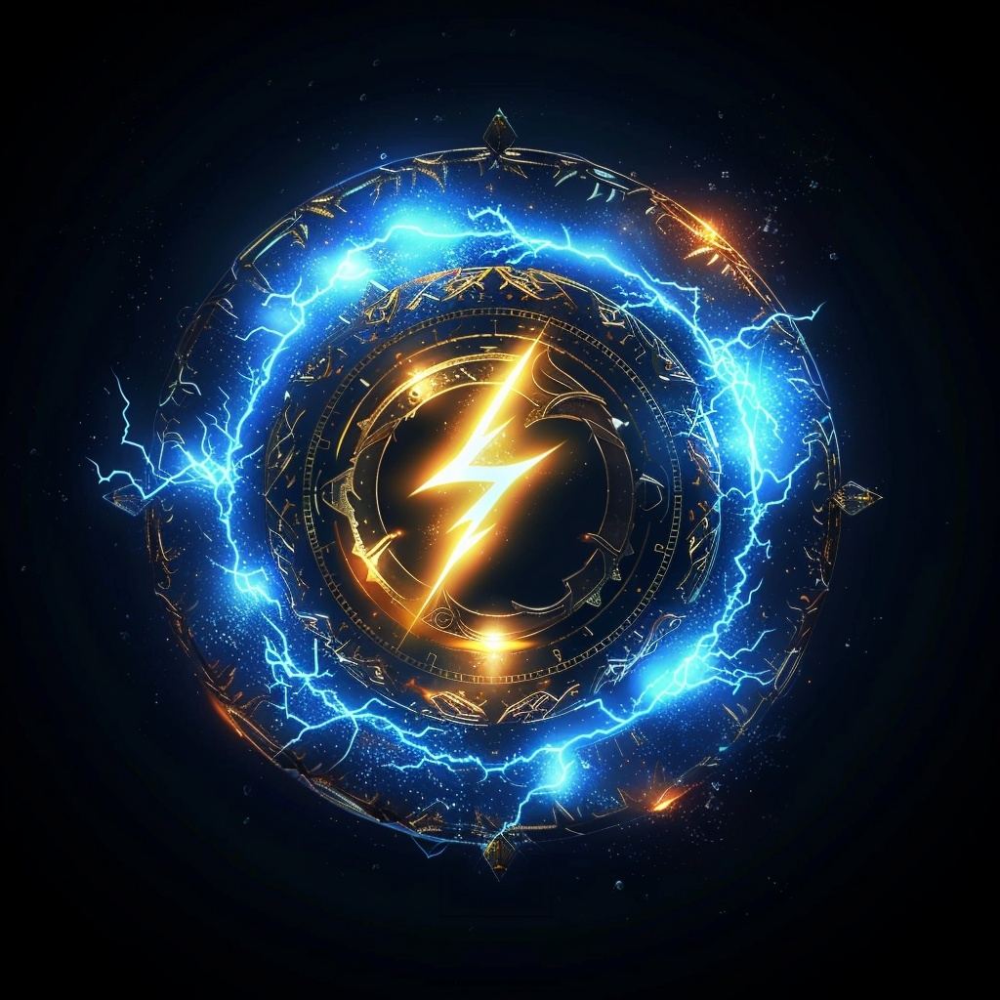
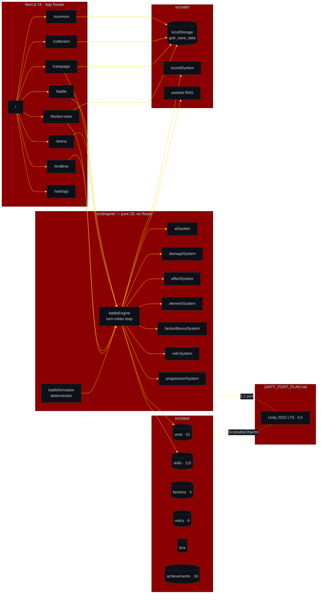
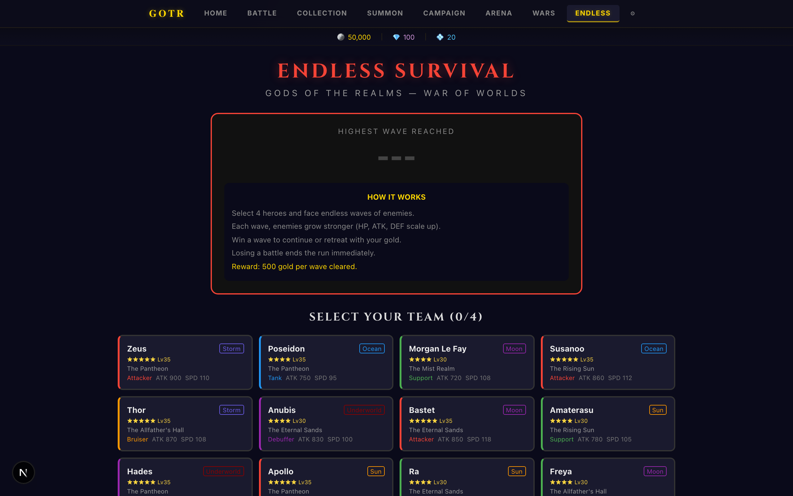
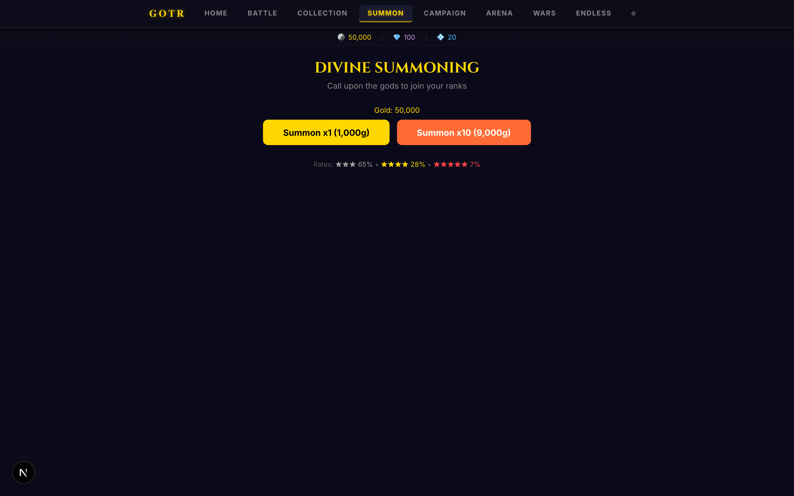

<!-- ──────────────────────────────────────────────────────────────────────── -->
<!--  Gods Of The Realms · War of Worlds                                     -->
<!--  Mythology gacha-RPG · turn-meter combat · five pantheons collide       -->
<!-- ──────────────────────────────────────────────────────────────────────── -->

<p align="center">
  
</p>

<h1 align="center">Gods Of The Realms — War of Worlds</h1>

<p align="center"><sub>mobile-style gacha RPG · turn-meter combat · five pantheons collide</sub></p>

<p align="center">
  
  
  
  
  
  
  
  
  
  
</p>

<p align="center">
  <b>Most "play in browser" mythology projects fall apart the second combat starts — no real turn order, no element matchups, no passives, just hit-points draining.</b><br/>
  Gods Of The Realms ships an actual gacha-RPG combat engine: speed-based turn meter, five-element advantage matrix, faction bonuses, relic sets, passives, and seeded-RNG determinism — all running in the browser and laid out for a 1:1 Unity port (see <a href="UNITY_PORT_PLAN.md"><code>UNITY_PORT_PLAN.md</code></a>).
</p>

<p align="center">
  <a href="#-quickstart">play locally →</a> ·
  <a href="UNITY_PORT_PLAN.md">unity plan</a> ·
  <a href="docs/architecture.svg">architecture</a> ·
  <a href="#%EF%B8%8F-five-pantheons">pantheons</a> ·
  <a href="#-combat-engine">combat</a>
</p>

---

```text
$ gotr battle --p1=zeus,thor,amaterasu,athena --p2=hades,loki,susanoo,fenrir --seed=0xC0FFEE
[t=000ms] battle.start  arena=campaign:8 "Divine Convergence"  rng=mulberry32(0xC0FFEE)
[t=000ms] turnmeter     zeus=0  thor=0  amaterasu=0  athena=0  hades=0  loki=0  susanoo=0  fenrir=0
[t=040ms] tick          amaterasu=100 ▶ acts first  (spd=145, fastest)
[t=040ms] passive       Sun's Light: amaterasu cleanses team on action
[t=045ms] target.pick   amaterasu → loki  (element: SUN > STORM, x1.15)
[t=048ms] skill.cast    "Solar Flare"  multi-hit ×3  base=120
[t=060ms] damage.resolve loki -432 (crit), shielded by 80, net -352  HP 1100→748
[t=060ms] effect.apply   loki: BURN(2t, 8% maxHP)
[t=110ms] tick          hades=100 ▶ acts  (spd=130)
[t=120ms] skill.cast    "Soul Drain"  → amaterasu  -210  heal hades +180
[t=120ms] effect.apply  amaterasu: HEAL_BLOCK(2t)
[t=210ms] tick          zeus=100 ▶ acts  passives.fire ON_TURN_START ×2
[t=215ms] skill.cast    "Thunderbolt"  AoE  → [hades, loki, susanoo, fenrir]
[t=220ms] damage.resolve aoe={-198,-156,-180,-204}  loki KO  faction bonus refunds 10% TM
[t=220ms] save           localStorage[gotr_save_data] += {progress, last_battle}
[t=220ms] sim.replay     same seed + same teams → identical 14-turn outcome  ✓
```

<p align="center"></p>

---

## architecture



<!-- mobile fallback (GitHub mobile app does not render mermaid) -->
<p align="center"></p>

> **Engine before content.** `src/engine/` is ~1,270 lines of pure-JS mechanics with no React or DOM imports — turn-meter, damage, effects, elements, faction bonuses, relics, progression, AI, and a deterministic simulator. `src/data/` is ~2,630 lines of pure data so adding heroes/skills means editing JSON-shaped objects, not code. Both layers translate cleanly to C# / ScriptableObjects per `UNITY_PORT_PLAN.md`.

---

## 🎲 by the numbers

| | |
|---|---|
| **Units** | 51 — 36 heroes + 15 creatures |
| **Skills** | 115 (basic, AoE, multi-hit, buffs, debuffs, heals, cleanses, strips, executes) |
| **Passives** | unique trigger system (`ON_TURN_START`, on-hit, on-kill, on-allied-death, …) |
| **Effects** | burn · freeze · stun · heal-block · shield · taunt · mark · slow · def-break · attack-up · def-up · immunity · speed-up |
| **Elements** | 5 — Storm · Ocean · Sun · Moon · Underworld |
| **Element matrix** | triangle (Storm > Ocean > Sun > Storm) + mutual pair (Moon ↔ Underworld) |
| **Multipliers** | advantage `×1.15` · disadvantage `×0.85` · mutual `×1.20` |
| **Relic sets** | 6 — 2-piece + 4-piece bonuses |
| **Achievements** | 16 across Battle / Collection / Campaign / Summon / Arena / Endless |
| **Campaign stages** | 10 — Easy → Legendary, with 3 named bosses (Titan Helios, Primordial Chaos, Chronos) |
| **Save format** | `localStorage["gotr_save_data"]` JSON, versioned · faction-wars uses `gotr_faction_wars` |
| **Determinism** | Mulberry32 seeded RNG → same seed + same teams → identical battle outcome |
| **Engine LOC** | 1,269 (combat, no React) · 2,633 (data) |

<sub><!-- TODO: measure --> Frame budget for the battle loop, p95 turn-resolve time, and largest hero-roster size before perf falls off aren't profiled — add once the Unity port lands and provides a reference baseline.</sub>

---

## ⚔️ five pantheons

| Faction | Mythology | Identity | Color |
|---|---|---|---|
| **The Pantheon** | Greek | Burst damage · crits · aggressive | <kbd>#FFD700</kbd> |
| **The Allfather's Hall** | Norse | Tanky · shields · counterplay | <kbd>#4FC3F7</kbd> |
| **The Eternal Sands** | Egyptian | Debuffs · sustain · attrition | <kbd>#CE93D8</kbd> |
| **The Mist Realm** | Celtic / Arthurian | Healing · buffs · team synergy | <kbd>#81C784</kbd> |
| **The Rising Sun** | Japanese | Speed · precision · tempo control | <kbd>#FF8A65</kbd> |

Source: `src/data/factions.js` · faction bonus implementation: `src/engine/factionBonusSystem.js` · per-unit lore: `src/data/lore.js`

---

## 🎮 game modes

| Mode | Route | What |
|---|---|---|
| **Battle** | `/battle` | Pick 4 heroes, fight AI teams · auto-battle · x1/x2/x3 speed |
| **Campaign** | `/campaign` | 10 progressive stages · scaled stats · 3 named-boss encounters |
| **Arena** | `/arena` | PvP ladder · Bronze → Silver → Gold → Platinum → Legend tiers · persistent rankings |
| **Endless** | `/endless` | Wave survival · scaling enemies · personal-best tracking |
| **Faction Wars** | `/faction-wars` | Weekly event · pick a faction to champion · tiered rewards |
| **Summon** | `/summon` | Gacha · 5-tier rarity · animated card reveals |
| **Collection** | `/collection` | Browse units · level / star up / awaken · equip relics · view lore |

<table>
  <tr>
    <td align="center"><br/><sub>battle · team select</sub></td>
    <td align="center"><br/><sub>campaign · 10 stages</sub></td>
  </tr>
  <tr>
    <td align="center"><br/><sub>arena · ranked PvP</sub></td>
    <td align="center"><br/><sub>endless · wave survival</sub></td>
  </tr>
  <tr>
    <td align="center"><br/><sub>faction wars · weekly</sub></td>
    <td align="center"><br/><sub>summon · gacha</sub></td>
  </tr>
  <tr>
    <td align="center"><br/><sub>collection · roster</sub></td>
    <td align="center"><br/><sub>settings · sound + reset</sub></td>
  </tr>
</table>

---

## 🛡 combat engine

<details open>
<summary><b>turn-meter loop</b></summary>

Every unit accrues turn-meter each tick at `(speed / maxSpeed) × TURN_METER_TICK_RATE`. The first to cross `TURN_METER_THRESHOLD` acts; ties broken by raw speed. After acting, turn-meter resets to 0 and the loop continues.

This is the same primitive used in SWGoH / Raid: Shadow Legends / Summoners War — speed isn't just a stat, it's the action economy. Faction bonuses can refund turn-meter on kill, push enemies' meter back on debuff, or cleanse to shed slow effects. Source: `src/engine/battleEngine.js` (494 LoC).

</details>

<details>
<summary><b>damage pipeline</b></summary>

`baseAttack × skillMultiplier × elementMod × critRoll × armorReduction × buffsDebuffs × shieldAbsorb`

- **Element advantage** — Storm > Ocean > Sun > Storm + mutual Moon ↔ Underworld (`elementSystem.js`)
- **Faction bonus** — passive synergy when ≥3 same-faction units in a team (`factionBonusSystem.js`)
- **Relics** — 2-piece + 4-piece set bonuses (e.g., Wrath, Vitality) (`relicSystem.js`)
- **Crit** — flat % roll; crits multiply post-element, pre-shield
- **Shields** — separate HP bucket consumed before real HP

</details>

<details>
<summary><b>effects + passives</b></summary>

Status effects with discrete tick semantics — DoTs apply at turn start, control effects (stun/freeze) skip the turn entirely, taunts force AI targeting, heal-block zeroes incoming heals, shields are consumed first.

Passive abilities fire on triggers like `on_turn_start`, `on_hit`, `on_kill`, `on_ally_ko`, `on_low_hp`. Stacking and exclusivity rules live in `effectSystem.js`.

</details>

<details>
<summary><b>determinism + simulator</b></summary>

`utils/random.js` exposes a Mulberry32 seeded RNG; `engine/battleSimulator.js` wraps `battleEngine` in a deterministic harness. Same seed + same teams + same skill order → byte-identical battle outcome — useful for replay, balance testing, and the eventual Unity port (which will reuse the same seed semantics via `System.Random` per `UNITY_PORT_PLAN.md`).

</details>

<details>
<summary><b>summon + progression + achievements</b></summary>

- **Summon pool** — rarity-weighted gacha rolls (`src/data/summonPool.js`); animated card reveals
- **Progression** — XP curve (lvl 1–40), star-up, awakening, per-hero stat scaling (`progressionSystem.js`)
- **Achievements** — 16 across Battle / Collection / Campaign / Summon / Arena / Endless with gold + essences + awaken-stones rewards (`src/data/achievements.js`)
- **Save** — single localStorage key `gotr_save_data` with versioned schema; no server, no account, no PII
- **Sound** — Web Audio API event-driven SFX (`utils/soundSystem.js`); volume + on/off in `/settings`

</details>

---

## 🚀 quickstart

requires **Node ≥ 20**.

```bash
git clone https://github.com/lloredia/Gods-Of-The-Realms-War-of-Worlds.git
cd Gods-Of-The-Realms-War-of-Worlds
npm install
npm run dev
```

open [http://localhost:3000](http://localhost:3000) — start at the home menu, head to **Summon** for a starter pull, then **Campaign** for stage 1.

production build:

```bash
npm run build && npm run start
```

**deploy:** zero-config Vercel — point Vercel at the repo, no env vars required. The save state lives in the player's browser, not on the server.

---

## 🗺 tree

```text
Gods-Of-The-Realms-War-of-Worlds/
├── src/
│   ├── app/                         Next.js App Router pages
│   │   ├── page.js                  Home menu
│   │   ├── battle/                  Custom team-vs-team
│   │   ├── campaign/                10 stages · Easy → Legendary
│   │   ├── arena/                   PvP matchmaking · Bronze → Legend
│   │   ├── endless/                 Wave survival
│   │   ├── faction-wars/            Weekly faction event
│   │   ├── summon/                  Gacha pulls
│   │   ├── collection/              Roster · level · awaken · equip
│   │   └── settings/                Sound / volume / reset save
│   ├── components/                  BattleUI · CombatLog · SkillButtons · UnitCard
│   │                                HeroPortrait · HeroDetailModal · BattleResults
│   │                                LevelUpPanel · TeamPresets · Tutorial
│   │                                AchievementPanel · AchievementToast · DailyRewards
│   ├── engine/                      Pure-JS combat — no React, no DOM
│   │   ├── battleEngine.js              Turn-meter main loop (494 LoC)
│   │   ├── battleSimulator.js           Deterministic batch simulator
│   │   ├── damageSystem.js              Damage pipeline
│   │   ├── effectSystem.js              Status effects + passives
│   │   ├── elementSystem.js             5-element advantage matrix
│   │   ├── factionBonusSystem.js        3+ same-faction synergies
│   │   ├── relicSystem.js               2pc + 4pc set bonuses
│   │   ├── progressionSystem.js         XP, levels, awakening
│   │   └── aiSystem.js                  Enemy + arena opponent AI
│   ├── data/                        Data-only modules
│   │   ├── units.js                     51 units (36 heroes + 15 creatures)
│   │   ├── skills.js                    115 skills
│   │   ├── factions.js                  5 factions
│   │   ├── relics.js                    6 sets
│   │   ├── effects.js                   status types
│   │   ├── summonPool.js                gacha rarity table
│   │   ├── lore.js                      per-unit lore + quotes
│   │   └── achievements.js              16 achievements
│   ├── constants/                   battleConstants · elementTable · enums
│   └── utils/                       saveSystem · soundSystem · seeded random · heroUtils
├── public/screenshots/              10 in-game captures (used in this README)
├── docs/architecture.{mmd,svg}      diagram source + mobile fallback
└── UNITY_PORT_PLAN.md               1:1 layered port plan to Unity 2022 LTS
```

---

## 🎮 roadmap

### now
- **Polish sweep** — most recent commits (`8f75c0b`, `7511fbb`) closed 19+ bugs across economy, targeting, timing, UX and added SSR guards on Faction Wars; collecting playtest signal before the next content drop.
- **Combat-log readability** — log is verbose; trimming ticks to player-meaningful events.

### next
- **Real audio assets** — replace WebAudio oscillator stubs with mixed track + per-skill SFX
- **Animated summon sequences** — card reveal exists; want full draw animation per rarity tier
- **Daily / weekly login rewards** — `DailyRewards.js` exists; backing economy needs a tuning pass
- **Public Vercel deploy** — push to a shareable URL; current README points to local dev only

### later
- **Unity port** — `UNITY_PORT_PLAN.md` lays out layer-by-layer translation; pure-JS engine ports cleanly with no React entanglement
- **Guild / clan system** — co-op campaign and shared chat
- **Story / lore browser** — per-unit lore exists in `src/data/lore.js`; deserves a dedicated codex screen
- **PvP leaderboard rewards** — arena tiers exist, end-of-season rewards still TBD

source: recent commits, `UNITY_PORT_PLAN.md`, in-source TODOs.

---

## 🤝 contributing

- this is a solo prototype; PRs welcome but expect opinionated direction
- one feature per PR · keep diffs reviewable
- no TypeScript yet — match the existing `.js` style (single quotes, 2-space indent)
- adding a hero? edit `src/data/units.js` only; engine should not need changes
- adding a skill? edit `src/data/skills.js`; if you need a new effect/trigger, add it to `effects.js` and `effectSystem.js` together
- if you touch a screen, add a screenshot at the same path under `public/screenshots/` and update the README table

---

<p align="center"><sub>built by <a href="https://github.com/lloredia">@lloredia</a> · five pantheons · one battlefield</sub></p>
