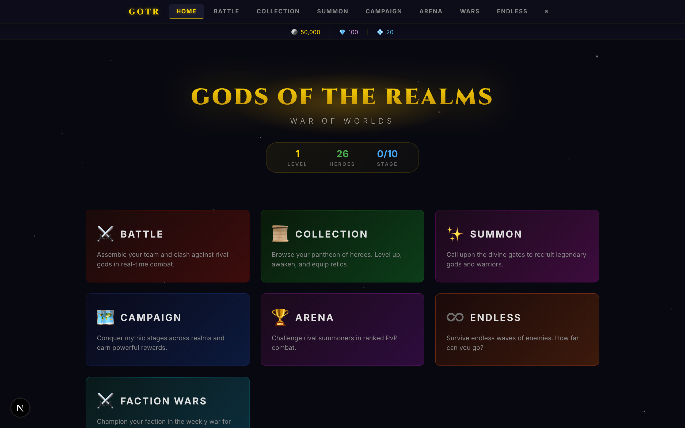
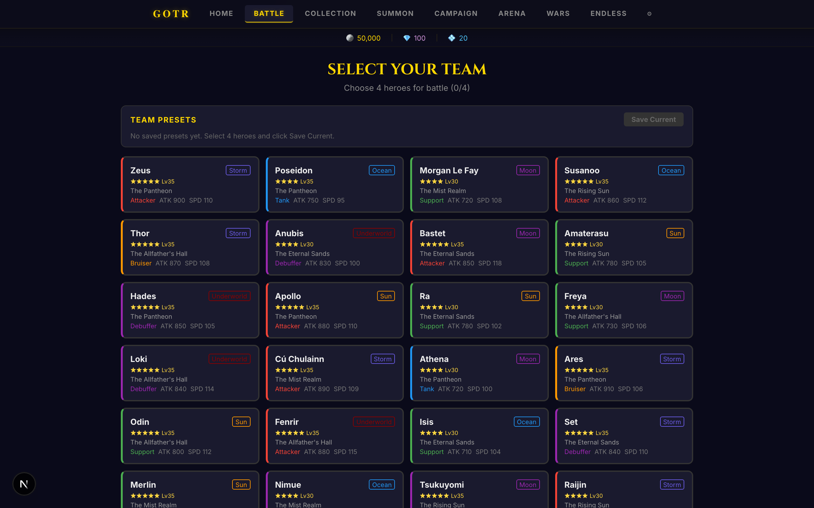
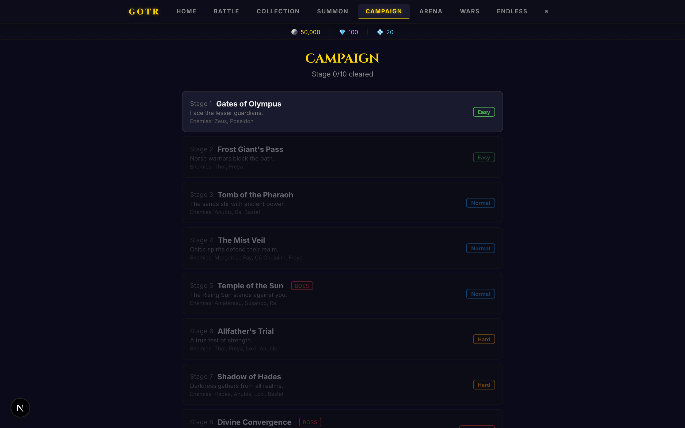
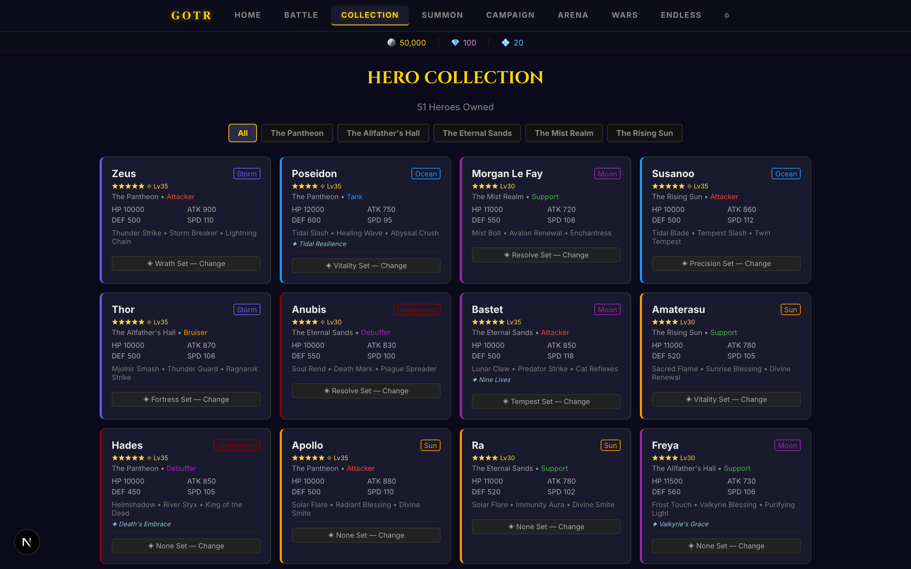
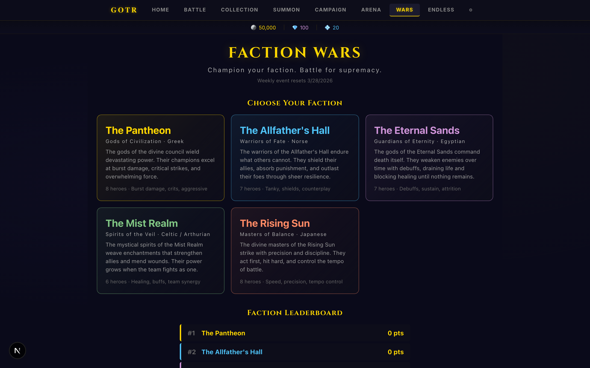
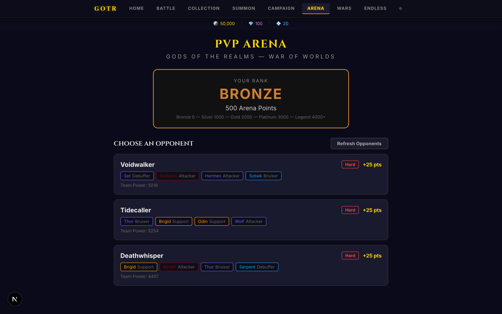
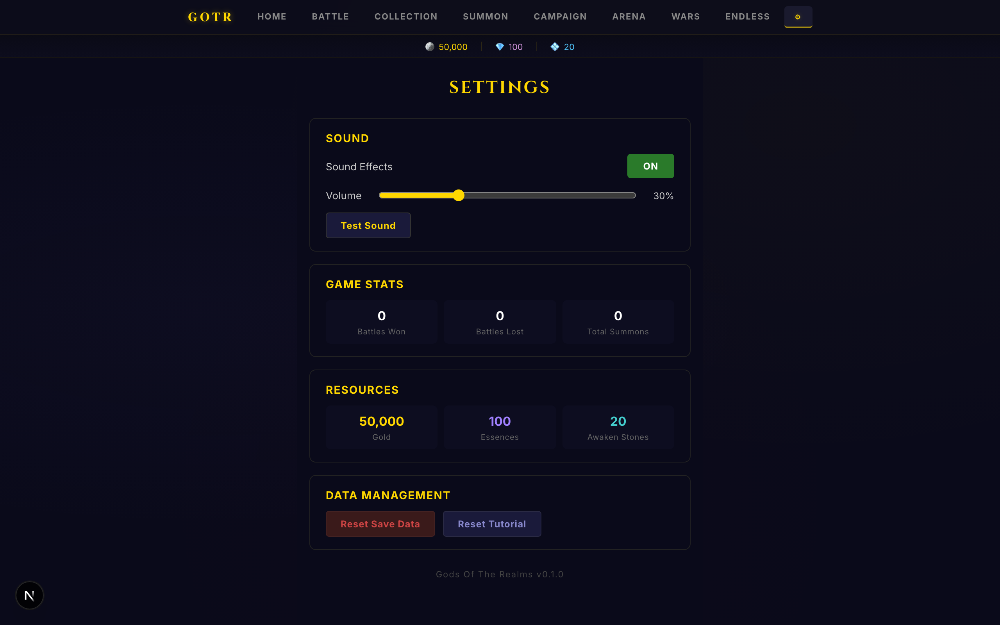

# Gods Of The Realms — War of Worlds

A deep turn-based battle RPG featuring gods, heroes, and creatures from 5 mythologies. Built as a fully playable web prototype with a production-ready engine designed for Unity migration.



## Features

### 51 Playable Units
- **36 Heroes** across 5 mythological factions: Greek, Norse, Egyptian, Celtic, Japanese
- **15 Creatures** (goblins, wolves, wraiths, hydras, and more) as summon fodder and enemies
- Every unit has unique SVG vector art, backstory lore, and a dramatic quote

### Deep Combat System
- **Turn meter** speed-based system (Summoners War-inspired)
- **110+ unique skills** — damage, heal, buff, debuff, cleanse, strip, multi-hit, execute
- **5 elements** with advantage triangle: Storm, Ocean, Underworld, Sun, Moon
- **Buff/debuff system** — attack up, defense up, immunity, speed up, stun, defense break, slow, heal block
- **Passive abilities** — revive on fatal, turn-start heals, auto-cleanse
- **Critical hits** with screen shake, impact flash, and floating damage numbers
- **AI decision engine** — priority-based (kill confirm, combo setup, support, best damage)



### 7 Game Modes

| Mode | Description |
|---|---|
| **Battle** | Select 4 heroes, fight AI teams with auto-battle and x1/x2/x3 speed |
| **Campaign** | 10 progressive stages with 3 boss encounters (scaled stats) |
| **Arena** | PvP ladder with Bronze → Legend tiers, persistent rankings |
| **Endless** | Wave survival with scaling enemies, personal best tracking |
| **Faction Wars** | Weekly event — champion your faction, earn rewards |
| **Summon** | Gacha system with animated card reveals and 5-tier rarity |
| **Collection** | Browse heroes, level up, star up, awaken, equip relics |



### Full Progression Loop
- **Leveling** (1-40) with gold costs and stat scaling
- **Star rating** (1-6 stars) with essence costs
- **Awakening** (+15% stat bonus) with awaken stones
- **6 relic sets** (Wrath, Fortress, Tempest, Precision, Vitality, Resolve) with 2-piece and 4-piece bonuses
- **Faction bonuses** — team synergies at 2/3/4 same-faction heroes
- **All progression persists and affects actual battle stats**



### Engagement Systems
- **16 Achievements** across 5 categories with toast notifications and claimable rewards
- **Daily login rewards** — 7-day cycle with streak tracking
- **Team presets** — save/load up to 5 favorite team compositions
- **Hero lore** — every unit has mythology-authentic backstory and quote
- **Tutorial** — 7-step guided walkthrough for new players



### Visual Polish
- **SVG vector portraits** for all 51 units — Zeus's lightning bolt, Thor's Mjolnir, Anubis's jackal head, Fenrir's wolf jaws
- **Battle animations** — attack shake, crit impact, heal glow, death fade, buff shimmer, revive burst
- **Skill VFX** — element-specific visual effects (lightning, water waves, dark pulses, solar flares)
- **Hit-stop + screen shake** on critical hits
- **Floating damage/heal numbers**
- **Glass morphism navbar** with live resource tracking
- **Cinzel serif typography** for headings, Inter for body
- **Starfield particle background** on home screen
- **Sound effects** — 22 Web Audio tones (attack, crit, heal, buff, death, victory, level up, achievement, etc.)



### Hardened Engine
- **Seeded RNG** (Mulberry32) for deterministic battle replays
- **Battle simulator** — headless `simulateBattle()` and `batchSimulate(100)` for balance testing
- **Machine-readable combat logs** — every event includes turn number, acting unit ID, RNG state, pre/post HP, effect roll results
- **Combat Timing Law** — documented, immutable 6-step turn execution order
- **Framework-agnostic** — engine has zero UI dependencies, designed for Unity port



## Tech Stack

| Layer | Technology |
|---|---|
| Framework | Next.js 16.2.0 |
| UI | React 19.2.4 |
| Styling | Inline styles + CSS keyframes |
| Typography | Google Fonts (Cinzel + Inter) |
| Portraits | Inline SVG (3,120 lines of vector art) |
| Audio | Web Audio API (procedural tones) |
| Storage | localStorage |
| RNG | Mulberry32 (seeded, deterministic) |

## Project Structure

```
src/
  app/              # 10 Next.js pages
    page.js         # Home — menu, daily rewards, achievements, tutorial
    battle/         # Team select + battle with auto/speed controls
    collection/     # Hero roster, leveling, relic equipping
    summon/         # Gacha with animated card reveals
    campaign/       # 10 stages + 3 boss encounters
    arena/          # PvP ladder with persistent rankings
    endless/        # Wave survival mode
    faction-wars/   # Weekly faction event
    settings/       # Volume, sound, reset, stats
  components/       # React components
    BattleUI.js     # Main battle state machine (~550 lines)
    UnitCard.js     # Hero card with animations, portraits, damage numbers
    HeroPortrait.js # SVG vector portraits for all 51 units (3,120 lines)
    BattleResults.js # Victory/defeat overlay with stats
    SkillEffect.js  # Element-specific skill VFX
    + 10 more...
  engine/           # Framework-agnostic battle engine
    battleEngine.js # Turn meter, skill execution, passives
    damageSystem.js # Damage formula with DEF scaling, crits, elements
    effectSystem.js # Buff/debuff application, resistance, timing
    aiSystem.js     # Priority-based AI decision tree
    battleSimulator.js # Headless simulation for balance testing
  data/             # Game data (all 51 units, 110+ skills, lore, etc.)
  constants/        # Enums, battle tuning values, element table
  utils/            # RNG, sound system, save system, achievement tracker
```

## Getting Started

```bash
# Clone
git clone https://github.com/lloredia/Gods-Of-The-Realms-War-of-Worlds.git
cd Gods-Of-The-Realms-War-of-Worlds

# Install
npm install

# Run
npm run dev

# Open
open http://localhost:3000
```

## Game Balance

All heroes have been through a balance pass:
- **Unique skill kits** — no two heroes share identical skills
- **3-star heroes** have 3 skills each with viable stat budgets
- **Stat budgets** are consistent within each rarity tier
- **Summon rates**: 30% 1-star, 25% 2-star, 25% 3-star, 15% 4-star, 5% 5-star

### Balance Testing

The engine includes a headless battle simulator:

```javascript
import { simulateBattle, batchSimulate } from './src/engine/battleSimulator';
import { heroRoster } from './src/data/units';

// Single seeded battle
const result = simulateBattle(
  [heroRoster.zeus, heroRoster.poseidon, heroRoster.hades, heroRoster.apollo],
  [heroRoster.thor, heroRoster.anubis, heroRoster.bastet, heroRoster.amaterasu],
  { seed: 12345 }
);
console.log(result.winner, result.turns, result.duration);

// Batch test (100 runs)
const stats = batchSimulate(teamA, teamB, 100);
console.log(`A wins ${stats.aWinRate}%, B wins ${stats.bWinRate}%`);
```

## Unity Port

A comprehensive Unity port plan is available at [`UNITY_PORT_PLAN.md`](UNITY_PORT_PLAN.md). The engine is designed for layer-by-layer migration:

1. **Pure engine logic** → C# classes (no MonoBehaviour dependency)
2. **Data schema** → ScriptableObjects
3. **Battle event bus** → C# event system
4. **UI rendering** → Unity Canvas
5. **Animation hooks** → DOTween
6. **VFX/Audio** → Particle Systems + AudioMixer

Estimated timeline: 22-30 days for a working Unity prototype.

## The Five Factions

| Faction | Mythology | Playstyle | Color |
|---|---|---|---|
| **The Pantheon** | Greek | Burst damage, crits | Gold |
| **The Allfather's Hall** | Norse | Tanks, shields, resilience | Ice Blue |
| **The Eternal Sands** | Egyptian | Debuffs, sustain, attrition | Purple |
| **The Mist Realm** | Celtic/Arthurian | Healing, buffs, synergy | Green |
| **The Rising Sun** | Japanese | Speed, precision, tempo | Orange |

## Roadmap

- [x] Core battle engine
- [x] 51 units with unique kits
- [x] 7 game modes
- [x] Full progression (leveling, stars, awakening, relics)
- [x] SVG character art
- [x] Battle animations + VFX + SFX
- [x] Engine hardening (seeded RNG, simulator, timing spec)
- [x] Unity port plan
- [ ] Deploy to Vercel
- [ ] Real character art (AI-generated or commissioned)
- [ ] Background music
- [ ] Unity prototype
- [ ] Real backend + authentication
- [ ] Multiplayer arena

## License

Private — all rights reserved.

---

*Built with Next.js 16, React 19, and a lot of mythology research.*
